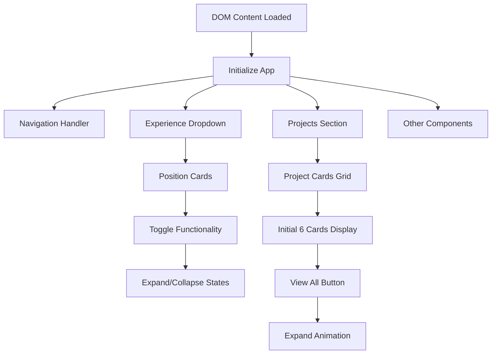
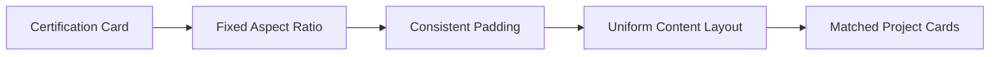

# Portfolio Issues Fix Design

## Overview

This design document outlines the strategic approach to fix three critical issues in the Mohammad Ibrahim portfolio website:

1. **Experience Dropdown Malfunction**: The interactive dropdown functionality in the experience section is not working properly
2. **Projects Display Optimization**: Currently all projects are visible; needs to limit initial display to 6 projects with an expandable view
3. **Certifications Grid Consistency**: The certification cards need uniform sizing to match the project cards layout

The portfolio is a frontend application built with vanilla HTML, CSS, and JavaScript, following a modern responsive design pattern with CSS custom properties and grid layouts.

## Architecture

### Current System Structure
The portfolio follows a single-page application (SPA) pattern with:
- **HTML Structure**: Semantic sections with proper accessibility attributes
- **CSS Architecture**: Custom properties-based design system with modular component styling
- **JavaScript Functionality**: Event-driven interactions with initialization-based module pattern
- **Responsive Design**: Mobile-first approach with breakpoint-based adaptations

### Component Interaction Model

## Problem Analysis & Solution Strategy

### 1. Experience Dropdown Issue Analysis

#### Current Implementation Assessment
The experience section uses a card-based layout with expandable details. The JavaScript includes an `initializeExperienceDropdown()` function, but the implementation may have selector or event binding issues.

#### Root Cause Identification
- **CSS Transition Conflicts**: The expand/collapse animations might be interfering with each other
- **Event Delegation Issues**: Click handlers may not be properly bound to dynamically generated content
- **State Management**: The expanded/collapsed state tracking might be inconsistent

#### Solution Architecture
- **Enhanced Event Binding**: Implement robust event delegation with proper selector targeting
- **State Synchronization**: Ensure CSS classes and ARIA attributes remain synchronized
- **Animation Optimization**: Refine transition timing and easing functions for smooth interactions

### 2. Projects Display Strategy

#### Current State Analysis
All project cards are currently visible simultaneously, which creates:
- **Information Overload**: Users face too many choices at once
- **Page Performance**: Longer initial render time
- **User Experience**: Reduced focus on primary projects

#### Progressive Disclosure Design
Implement a progressive disclosure pattern:
- **Initial State**: Display exactly 6 featured projects
- **Interaction Trigger**: "View All Projects" button
- **Expanded State**: Reveal remaining projects with staggered animation
- **State Persistence**: Maintain expanded state during session

#### Implementation Strategy
- **CSS Visibility Control**: Use display properties to hide/show projects
- **JavaScript Animation**: Implement fadeIn effects with staggered timing
- **Button State Management**: Dynamic button text and visibility

### 3. Certifications Grid Standardization

#### Current Layout Analysis
The certifications section uses a different card sizing approach than projects, creating visual inconsistency:
- **Card Dimensions**: Irregular heights and widths
- **Content Alignment**: Inconsistent padding and spacing
- **Visual Hierarchy**: Different from projects section

#### Design Consistency Framework
Establish uniform card specifications:
- **Dimensions**: Match project card aspect ratios
- **Spacing**: Consistent internal padding and margins
- **Typography**: Aligned font sizing and hierarchy
- **Interactive States**: Uniform hover and focus effects

## Technical Implementation Plan

### Experience Dropdown Enhancement

#### JavaScript Event System Redesign
- **Improved Selector Targeting**: More specific CSS selectors for position cards
- **Event Delegation**: Proper event bubbling and delegation patterns
- **State Management**: Consistent ARIA and CSS class synchronization

#### CSS Animation Refinement
- **Transition Optimization**: Smooth height transitions with proper timing
- **Transform Coordination**: Synchronized icon rotation and content reveal
- **Visual Feedback**: Enhanced hover and focus states

### Projects Section Modification

#### HTML Structure Preservation
Maintain existing semantic structure while adding:
- **Data Attributes**: Project indexing for JavaScript targeting
- **Button Container**: Dedicated space for expand/collapse controls

#### CSS Display Logic
- **Initial State**: First 6 projects visible, others hidden
- **Transition Classes**: Fade-in animations for revealed projects
- **Button Styling**: Consistent with existing design system

#### JavaScript Interaction Logic
- **Card Enumeration**: Identify and categorize visible/hidden projects
- **Animation Sequencing**: Staggered reveal with timing controls
- **Button Management**: Dynamic text and state changes

### Certifications Grid Standardization

#### Grid Layout Optimization

#### Visual Consistency Rules
- **Card Dimensions**: Maintain 1:1.2 aspect ratio similar to project cards
- **Content Hierarchy**: Title, organization, date, skills progression
- **Interactive Elements**: Consistent button styling and placement

## User Experience Flow

### Enhanced Experience Section Interaction
1. **Initial State**: Position cards display summary information with collapse indicator
2. **User Interaction**: Click or keyboard activation triggers expansion
3. **Transition Effect**: Smooth content reveal with icon rotation
4. **Expanded State**: Full details visible with collapse option
5. **Accessibility**: Screen reader announcements and keyboard navigation

### Optimized Projects Discovery
1. **Landing Experience**: 6 featured projects prominently displayed
2. **Interest Indication**: "View All Projects" button draws attention
3. **Expansion Trigger**: User clicks to see complete portfolio
4. **Progressive Reveal**: Additional projects appear with staggered animation
5. **Content Access**: All projects now visible with smooth scrolling

### Consistent Visual Experience
1. **Unified Layout**: All card-based sections follow same design principles
2. **Predictable Interactions**: Hover and focus states work consistently
3. **Visual Hierarchy**: Clear information architecture across sections
4. **Brand Consistency**: Maintained design system throughout

## Testing Strategy

### Functional Testing Areas
- **Dropdown Interaction**: Verify expand/collapse functionality across all position cards
- **Projects Display**: Confirm initial 6-project display and proper expansion
- **Button Behavior**: Test "View All" button state management
- **Responsive Design**: Validate functionality across device breakpoints

### Accessibility Validation
- **Keyboard Navigation**: Ensure all interactive elements are accessible via keyboard
- **Screen Reader Compatibility**: Verify ARIA labels and announcements
- **Focus Management**: Proper focus indicators and navigation flow
- **Color Contrast**: Maintain WCAG compliance for all interactive elements

### Performance Considerations
- **Animation Performance**: Smooth 60fps animations without layout thrashing
- **Initial Load Time**: No degradation from additional JavaScript functionality
- **Memory Usage**: Efficient event listener management
- **Mobile Performance**: Optimized for touch interactions and reduced processing power

## Deployment Considerations

### Browser Compatibility
- **Modern Browser Support**: CSS Grid, Flexbox, and ES6+ features
- **Progressive Enhancement**: Graceful degradation for older browsers
- **Touch Device Optimization**: Proper touch targets and interactions

### Maintenance Guidelines
- **Code Organization**: Modular JavaScript functions for easy updates
- **CSS Architecture**: Component-based styling for future modifications
- **Documentation**: Clear commenting for future development

This design ensures all three issues are resolved while maintaining the existing design system integrity and enhancing the overall user experience through improved interaction patterns and visual consistency.