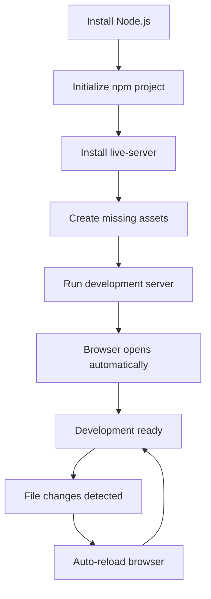

# Webpage Project Setup and Deployment Design

## Overview

This design document outlines the strategy for setting up, configuring, and running a personal portfolio website project. The project is a frontend application featuring Mohammad Ibrahim's AI/ML engineering portfolio with modern web technologies and requires a local development server for proper functionality.

### Project Characteristics
- **Repository Type**: Frontend Application (Personal Portfolio)
- **Technology Stack**: HTML5, CSS3, JavaScript (Vanilla)
- **Architecture**: Static Single Page Application
- **Purpose**: Professional portfolio showcasing AI/ML engineering expertise

## Current State Analysis

### Project Structure
```
webpage2/
├── css/
│   └── style.css          # Complete styling with CSS custom properties
├── js/
│   └── main.js           # Interactive functionality and animations
├── index.html            # Main portfolio page (655 lines)
├── package-lock.json     # Empty packages object
├── run.bat              # Current server start script
├── push.bat             # Deployment script
└── setup.sh             # Initial project setup script
```

### Identified Issues
1. **Missing Development Server**: `live-server` package not installed
2. **Incomplete Dependency Management**: No `package.json` with proper dependencies
3. **Missing Asset Directory**: Referenced assets folder doesn't exist
4. **Development Environment Not Configured**: No Node.js environment setup

## Architecture Design

### System Components

| Component | Purpose | Technology | Status |
|-----------|---------|------------|--------|
| Portfolio Frontend | User interface and content presentation | HTML5, CSS3, JavaScript | ✅ Complete |
| Development Server | Local hosting and hot reload | live-server (Node.js) | ❌ Missing |
| Asset Management | Images and media files | File system | ⚠️ Partial |
| Build System | Development workflow | npm scripts | ❌ Missing |

### Technology Dependencies

| Dependency | Type | Purpose | Installation Method |
|------------|------|---------|-------------------|
| Node.js | Runtime | JavaScript execution environment | System installation |
| npm | Package Manager | Dependency management | Bundled with Node.js |
| live-server | Development Tool | Local development server with hot reload | npm install |

## Development Environment Setup Strategy

### Phase 1: Environment Preparation
**Objective**: Establish Node.js development environment

**Actions Required**:
1. Verify Node.js installation on target system
2. Initialize npm project with proper configuration
3. Install required development dependencies
4. Configure package scripts for development workflow

### Phase 2: Dependency Installation
**Objective**: Install and configure live-server

**Technical Specification**:
- Package: `live-server` (development dependency)
- Configuration: Port 5000 as specified in current run.bat
- Features: Hot reload, CORS support, default browser opening

### Phase 3: Asset Directory Creation
**Objective**: Resolve missing asset references

**Requirements**:
- Create `assets/` directory structure
- Address missing profile.png reference in hero section
- Ensure proper image path resolution

## Package Configuration Design

### package.json Structure
```
Project Metadata:
- Name: webpage2
- Version: 1.0.0
- Description: Mohammad Ibrahim's AI/ML Engineer Portfolio
- License: Private

Development Dependencies:
- live-server: ^1.2.2

Scripts Configuration:
- start: Launch development server on port 5000
- serve: Alternative server command
- dev: Development mode with specific configurations
```

### npm Scripts Strategy

| Script Name | Command | Purpose |
|-------------|---------|---------|
| `start` | `live-server --port=5000` | Primary development server |
| `serve` | `live-server --port=5000 --open` | Server with auto-browser opening |
| `dev` | `live-server --port=5000 --watch=css,js` | Development with file watching |

## Server Configuration Design

### Live Server Settings
- **Port Configuration**: 5000 (maintains compatibility with existing run.bat)
- **Root Directory**: Project root (webpage2/)
- **Hot Reload**: Enabled for CSS and JavaScript files
- **Browser Auto-Open**: Configurable option
- **CORS Support**: Enabled for external resource loading

### Security Considerations
- Local development only (127.0.0.1 binding)
- No external network exposure
- Safe for development environment usage

## Asset Management Strategy

### Required Assets
Based on HTML analysis, the following assets are referenced:

| Asset Type | File Reference | Status | Resolution Strategy |
|------------|----------------|--------|-------------------|
| Profile Image | `assets/profile.png` | Missing | Create placeholder or provide image |
| Favicon | Data URI SVG | ✅ Present | No action needed |
| External Fonts | Google Fonts CDN | ✅ Linked | No action needed |
| Icons | Font Awesome CDN | ✅ Linked | No action needed |

### Asset Directory Structure
```
assets/
├── profile.png          # Profile image for hero section
├── certificates/        # Certification documents
└── projects/           # Project screenshots (optional)
```

## Development Workflow Design

### Primary Development Flow


### Alternative Development Options

| Method | Command | Use Case |
|--------|---------|----------|
| Python Server | `python -m http.server 5000` | Quick testing without Node.js |
| VS Code Live Server | Extension-based | IDE-integrated development |
| Browser File Protocol | Direct file opening | Basic functionality testing |

## Error Resolution Strategy

### Common Issues and Solutions

| Issue | Symptoms | Resolution |
|-------|----------|-----------|
| live-server not found | Command not recognized | Install Node.js and live-server package |
| Port 5000 in use | Connection refused | Use alternative port or kill existing process |
| Asset loading failures | Broken images, 404 errors | Create missing asset files |
| CORS restrictions | External resource blocks | Use proper development server (not file://) |

### Diagnostic Commands
- `node --version` - Verify Node.js installation
- `npm --version` - Verify npm availability
- `netstat -an | find "5000"` - Check port availability
- `npm list live-server` - Verify package installation

## Implementation Commands

### Setup Sequence
```
1. cd C:\Users\mohammad\Desktop\webpage2
2. npm init -y
3. npm install --save-dev live-server
4. mkdir assets
5. npm start
```

### Package.json Generation
The npm init command will create a package.json with project metadata and the installed live-server dependency will be automatically added to devDependencies.

## Validation Criteria

### Success Indicators
- ✅ Development server starts successfully on port 5000
- ✅ Website loads in browser without errors
- ✅ Hot reload functionality works for CSS/JS changes
- ✅ All external resources (fonts, icons) load properly
- ✅ Navigation and interactive features function correctly

### Performance Expectations
- Initial server startup: < 3 seconds
- Page reload time: < 1 second
- Asset loading: < 2 seconds on local network

This design provides a comprehensive strategy for resolving the live-server setup issues and establishing a proper development environment for the portfolio website.